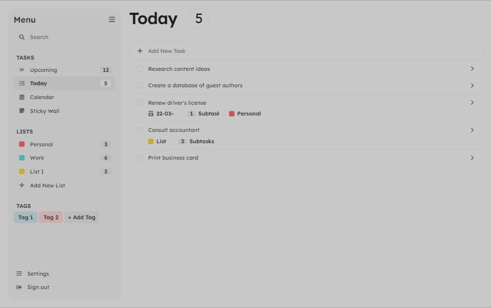

# ToDo Application

Welcome to the Laravel ToDo Application! This application is built using Laravel,api, vue js and blade template and provides a simple and efficient way to manage your tasks and lists.

## Table of Contents

- [Features](#features)
- [Getting Started](#getting-started)
  - [Prerequisites](#prerequisites)
  - [Installation](#installation)
- [Usage](#usage)
- [Routes](#routes)
- [Contributing](#contributing)
- [License](#license)

## Features

- **Dashboard:** Overview of tasks and lists.
- **Profile Management:** Edit, update, and delete your profile.
- **Task Management:** Categorize tasks as upcoming, today, calendar, and sticky wall.
- **List Management:** Create and manage personal and work lists.
- **Settings:** Configure your application settings and sign out.

## Getting Started

### Prerequisites# ToDo Application

Welcome to the ToDo Application! This application is built using Laravel and provides a simple and efficient way to manage your tasks and lists.

## Table of Contents

- [Features](#features)
- [Getting Started](#getting-started)
  - [Prerequisites](#prerequisites)
  - [Installation](#installation)
- [Usage](#usage)
- [Routes](#routes)
- [Contributing](#contributing)
- [License](#license)

## Features

- **Dashboard:** Overview of tasks and lists.
- **Profile Management:** Edit, update, and delete your profile.
- **Task Management:** Categorize tasks as upcoming, today, calendar, and sticky wall.
- **List Management:** Create and manage personal and work lists.
- **Settings:** Configure your application settings and sign out.

## Getting Started

### Prerequisites

Make sure you have the following prerequisites installed on your machine:

- [PHP](https://www.php.net/) (>= 7.4)
- [Composer](https://getcomposer.org/)
- [Node.js](https://nodejs.org/) (for JavaScript dependencies)

### Installation

1. Clone the repository:

   ```bash
   git clone https://github.com/your-username/todo-app.git


Make sure you have the following prerequisites installed on your machine:

- [PHP](https://www.php.net/) (>= 7.4)
- [Composer](https://getcomposer.org/)
- [Node.js](https://nodejs.org/) (for JavaScript dependencies)

### Installation

# ToDo Application

Welcome to the ToDo Application! This application is built using Laravel and provides a simple and efficient way to manage your tasks and lists.

## Table of Contents

- [Features](#features)
- [Getting Started](#getting-started)
  - [Prerequisites](#prerequisites)
  - [Installation](#installation)
- [Usage](#usage)
- [Routes](#routes)
- [Contributing](#contributing)
- [License](#license)

## Features

- **Dashboard:** Overview of tasks and lists.
- **Profile Management:** Edit, update, and delete your profile.
- **Task Management:** Categorize tasks as upcoming, today, calendar, and sticky wall.
- **List Management:** Create and manage personal and work lists.
- **Settings:** Configure your application settings and sign out.

## Getting Started

### Prerequisites

Make sure you have the following prerequisites installed on your machine:

- [PHP](https://www.php.net/) (>= 7.4)
- [Composer](https://getcomposer.org/)
- [Node.js](https://nodejs.org/) (for JavaScript dependencies)

### Installation


### Clone the repository

git clone https://github.com/diusazzad/laravel-todo-application

### Change into the project directory
cd todo-app

### Install PHP dependencies
composer install

### Install JavaScript dependencies

npm install && npm run dev

### Copy environment file

cp .env.example .env

### Update .env file with your configuration

### Open .env file in your favorite text editor, e.g., nano
open .env

### Generate application key
php artisan key:generate

### Run migrations and seed the database

php artisan mi --seed

### Start the development server

php artisan serve

